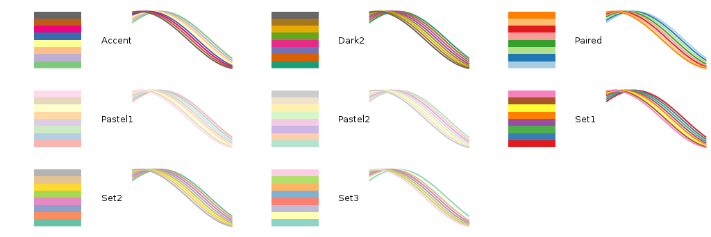
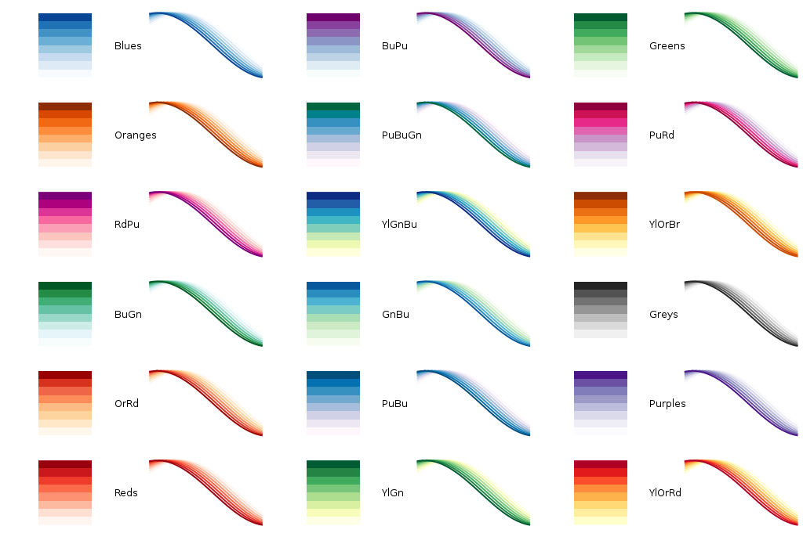
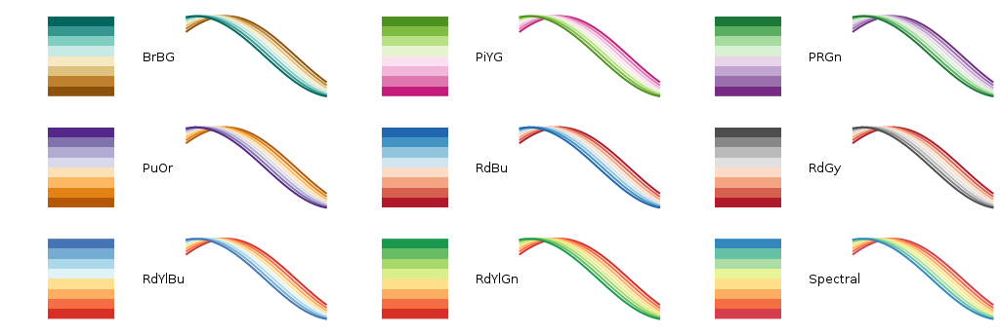

gnuplot-colorbrewer
===================

An easy way to use the beautiful color schemes at [ColorBrewer](http://colorbrewer2.org/) in the handy command-line plotting program [gnuplot](http://www.gnuplot.info/). 

All ColorBrewer color schemes that include at least 8 colors are included. Each color scheme provides 8 discrete colors and a continuous color palette. See the <code>examples</code> directory for sample code and output.

Qualitative Color Schemes
-------------------------

Qualitative color schemes are good for comparing data sets without emphasizing any inherent ordering: attributes of categorically-grouped data, plots of data points and fits to the data, etc. These color schemes are in the <code>qualitative</code> directory. Specifically, there are 2 schemes that I use frequently (Set1, Paired) and 6 others (Accent, Pastel1, Set2, Dark2, Pastel2, Set3). Note that heatmaps are unlikely to be useful for qualitative color schemes.

Sequential Color Schemes
-------------------------

Sequential color schemes are good for emphasizing one extreme of ordered data: data collected at different time points, maps of population densities, etc. These color schemes are in the <code>sequential</code> directory. Specifically, there are 6 single hue schemes (Greys, Purples, Blues, Greens, Oranges, Reds) and 12 multihue schemes (BuGn, BuPu, GnBu, OrRd, PuBu, BuGn, PuRd, RdPu, YlGn, YlGnBu, YlOrBr, YlOrRd). Note that color #1 is very difficult to see on a white background.

Diverging Color Schemes
-------------------------

Diverging color schemes are good for emphasizing both extremes of ordered data: attributes of those with positive/neutral/negative opinions on an issue, maps of temperature deviation from a mean, etc. These color schemes are in the <code>diverging</code> directory. Specifically, there are 6 schemes centered about white (BrBG, PiYG, PuGn, PuOr, RdGy, RdBu) and 3 centered about yellow (RdYlGn, RdYlBu, Spectral). Note that Spectral is the most rainbow-like of the ColorBrewer schemes, although the central yellows are deemphasized compared to other rainbow or jet color schemes.

Usage
-----

First, choose your desired color scheme by perusing [ColorBrewer](http://colorbrewer2.org/) and the PostScript files included in the <code>examples</code> directory. I also like the concise [colormap reference](http://www.scipy.org/Cookbook/Matplotlib/Show_colormaps) in the Matplotlib Cookbook.

To use any color scheme, just load it before calling <code>plot</code> or <code>splot</code> in your gnuplot script or interactive session. For example:

      load 'path/to/sequential/Greens.plt'

When plotting lines or points, add the property <code>linestyle i</code> (aka <code>ls i</code>) to your <code>plot</code> call to use color number <code>i</code>. For example:

     load 'path/to/qualitative/Paired.plt'
     plot cos(x) ls 1, sin(x) ls 2

All non-color properties (e.g., point style) will match the defaults for the first 8 line types. If you want to modify other properties, simply copy the contents of the color scheme plt file into your plotting script and modify each line style there.

When plotting using a continuous color palette, simply use your usual <code>splot</code> call. To use a reversed color palette, include the line <code>set palette negative</code> before plotting. For example, this snippet plots a surface with low values colored blue and high values colored red: 

     load 'path/to/diverging/RdBu.plt'
     set palette negative
     splot cos(x) w pm3d

Full example code and output is available for both line and palette modes. For example, to produce the output at <code>examples/qualitative_colored_lines.ps</code>, run this in a shell:

     cd path/to/examples
     gnuplot qualitative_colored_lines.plt

Credits
------

gnuplot-colorbrewer is written and maintained by Anna Schneider <[annarschneider@gmail.com](mailto:annarschneider+github@gmail.com)>. ColorBrewer is a project of Cynthia Brewer, Mark Harrower, and The Pennsylvania State University.

License
-------

gnuplot-colorbrewer is released under the [Apache License 2.0](http://www.apache.org/licenses/LICENSE-2.0), as is ColorBrewer.

   Copyright 2013 Anna Schneider

   Licensed under the Apache License, Version 2.0 (the "License");
   you may not use this file except in compliance with the License.
   You may obtain a copy of the License at

   http://www.apache.org/licenses/LICENSE-2.0

   Unless required by applicable law or agreed to in writing, software
   distributed under the License is distributed on an "AS IS" BASIS,
   WITHOUT WARRANTIES OR CONDITIONS OF ANY KIND, either express or implied.
   See the License for the specific language governing permissions and
   limitations under the License.
